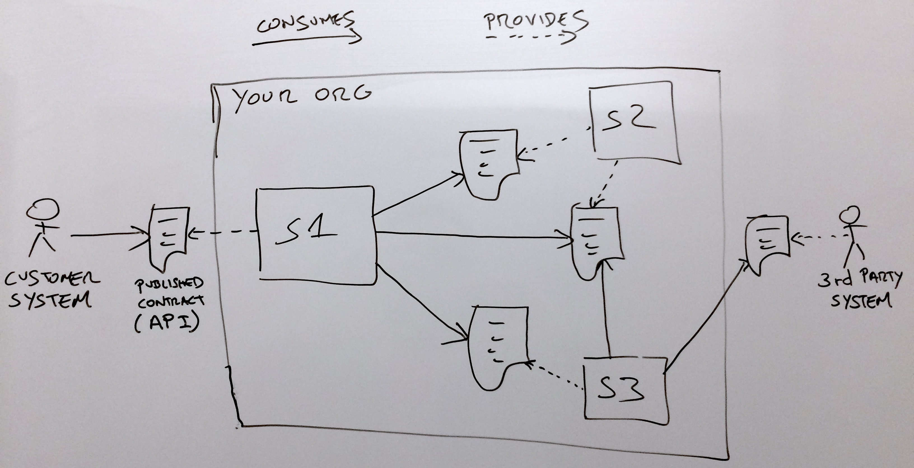
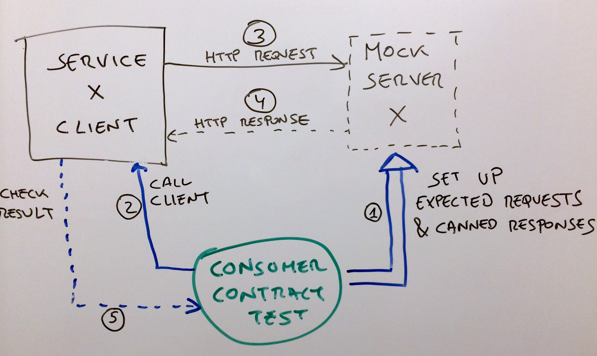
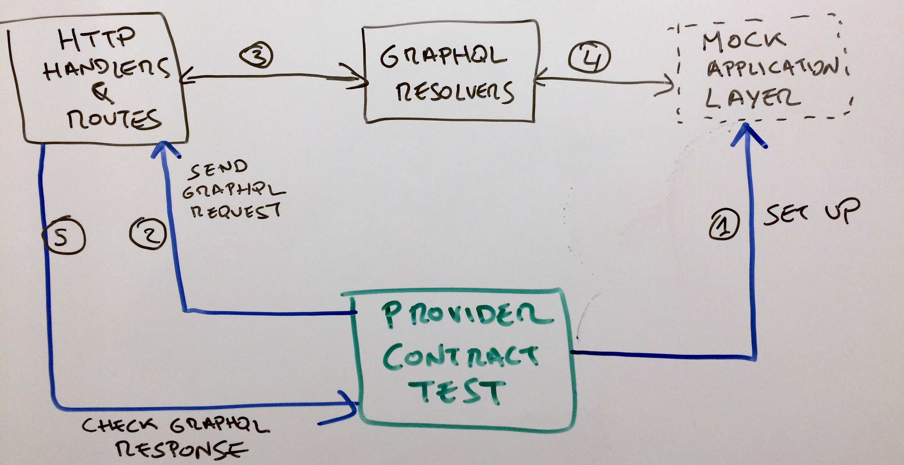
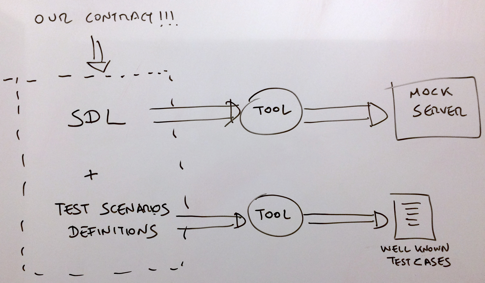
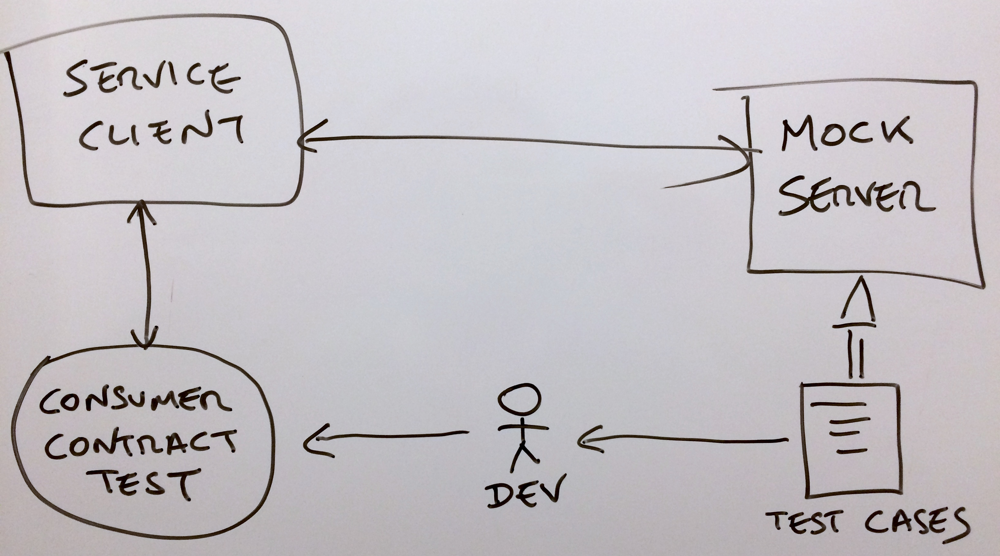
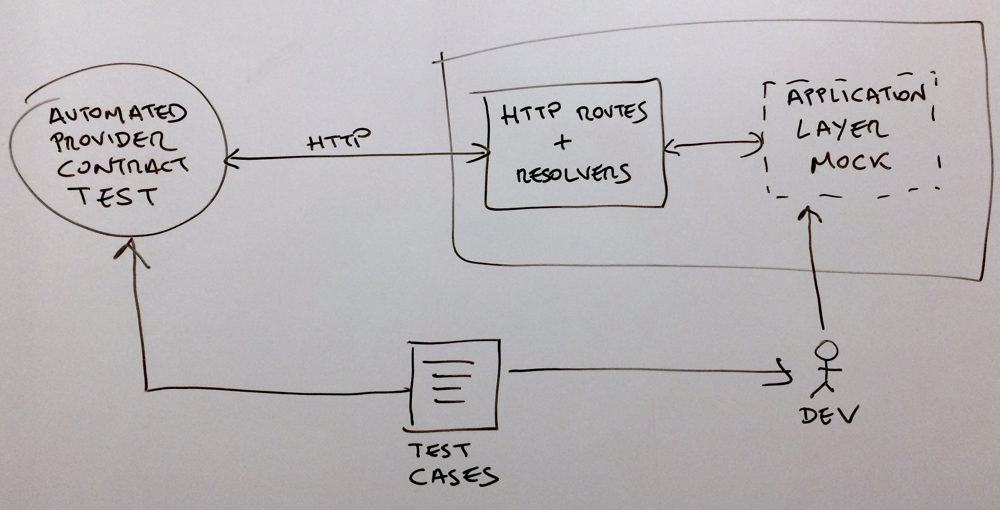

 <!-- .element style="max-height:100%"-->


# @eamodeorubio <!-- .element: style="color: yellow;text-transform: none" -->

<a href="https://www.contentful.com/" rel="nofollow" target="_blank"></a>


# <span style="color: red">Doomed</span> to microservice


### Monolith heaven


### After a while...


## Too many features
### (Anyone heard about SRP?)


### Maintenance problems

* Who approves the PR?
* Shared ownership -> Unclear ownership?
* The code for each feature is decoupled/isolated?
* Building a huge project
* IDE performance for a huge project?
* Test suite run time for the whole project?


### Risk &amp; availability problems

* The more features the more code updates
* Each deploy is a risk
* Deploy strategy
  * Per PR or feature update -> High risk
  * Release trains -> Long time to market


### Performance problems
#### It's a big monolith

* How much load?
* How much memory?
* How much CPU?
* How long to restart?
* How to performance tune?


### Infectious features

* All features live in the same process
* One problem in one could cause problems in all of the others
  * Memory leaks
  * High CPU consumption
  * Unresponsive/Unstable system
  * Crashed system
* Not all features are equally important!!


### Let's break the monolith
#### (a.k.a microservices)


### After a while...
#### You get a distributed monolith


### Organic architectural growth
#### It's agile!

* Which service talks with which one?
* How to talk with that other service?
* Is there a service that does what I need?


### If you are doomed to microservice, then follow Conway's law by heart


### Either your <span style="color:red">teams are coupled</span> to support <span style="color:red">coupled Microservices</span>


### Or your microservices are <span style="color:green">decoupled</span> because your teams are


### Each microservice should treat others as <span style="color:yellow">third parties</span>


### To do so we need contracts...


# Contracts with
# &#x1F680;<span style="color:green;text-transform:none">GraphQL</span>&#x1F680;


### Contracts everywhere




### What's inside a contract?
#### <span style="color:yellow">Data model</span>

```protobuf
message PersonalInfo {
  required string name;
  optional string email;
}

message Employee {
  required number employeeId;
  required PersonalInfo info;
}
```


### What's inside a contract?
#### <span style="color:yellow">Data over the network</span>

```json
{
  "employeeId": 33,
  "info": {
    "name": "John",
    "email": null
  }
}
```


### What's inside a contract?
#### <span style="color:yellow">Operations</span>

```protobuf
service EmployeeService {
  rpc hire(PersonalInfo) returns (Employee);
}
```


### What's inside a contract?
#### <span style="color:yellow">Operations over the network</span>

```http
POST /employee/rpc HTTP/1.1
Host: example.org
Authorization: Bearer AbCdEf123456
Content-Type: application/json; charset=utf-8

{
  "op": "hire",
  "args": [{
    "name": "John",
    "email": null
  }]
}
```


### What's inside a contract?
#### <span style="color:yellow">Operations over the network</span>

```http
HTTP/1.1 200 OK
Date: Sun, 10 Oct 2010 23:26:07 GMT
Server: Apache/2.2.8 (Ubuntu) mod_ssl/2.2.8 OpenSSL/0.9.8g
Last-Modified: Sun, 26 Sep 2010 22:04:35 GMT
ETag: "45b6-834-49130cc1182c0"
Content-Type: application/json; charset=utf-8

{
  "employeeId": 33,
  "info": {
    "name": "John",
    "email": null
  }
}
```


### What's inside a contract?
#### <span style="color:yellow">Input/Output invariants</span>

* `findById(id: string): Employee` -> If found, we expect the result to have the same `id` as specified
* `updateName(id: string, name: string): Employee` -> If successful, we expect the returned employee to have the supplied name


### <span style="color:red">Not</span> part of the contract!
#### <span style="color:red">Domain logic</span>

```js
{
  "buyerId": 25252,
  "items": [
    {productId: 33, unitPrice: 10, quantity: 1},
    {productId: 40, unitPrice: 20, quantity: 2}
  ],
  "totalPrice": 30, // <-- Is this correct?
}
```

Why total price is not `50`?


## So what has <span style="color:green;text-transform:none">GraphQL</span> to do with contracts?


## GraphQL does *not* mandate how to serialise data


## But your organisation could define that internally


## Or just use the JSON serialisation standard

https://facebook.github.io/graphql/June2018/#sec-Serialization-Format


## GraphQL does *not* define how to transport it over the network


## But your organisation could define that internally


### Or just use the <span style="color:yellow;font-style:italic">de facto</span> standard

* Single endpoint: `/graphql`
* Use `GET` and `POST` ignoring their semantics
* Use `application/json` and JSON serialisation
* `4xx` for validation and security errors
* `200` for anything else (partial success)
* https://graphql.org/learn/serving-over-http/


### Data models with SDL

```graphql
scalar ProductRef
scalar Rating
enum ReviewStatus {
  PENDING
  ACCEPTED
  REJECTED
}
type ProductReview {
  id: ID!
  productRef: ProductRef!
  rating: Rating!
  commentary: String
  status: ReviewStatus!
}
```


### Queries &amp; Mutations with SDL

```graphql
input ReviewData {
  productRef: ProductId!
  rating: Rating!
  commentary: String
}

type Query {
  productReview(id: ReviewId!): ProductReview
}

type Mutation {
  postReview(review: ReviewData!): ProductReview!
  deleteReview(id: ReviewId!): boolean
}
```


### Errors &amp; partial failures

```json
{
  "data": {
    "review1": null,
    "review2": {
      "id": "1",
      "productRef": "urn:ishop:product:2",
      "rating": 4,
      "commentary": null,
      "status": "PENDING"
    }
  },
  "errors": [
    {
      "message": "Unexpected DB Error",
      "locations": [ { "line": 1, "column": 1 } ],
      "path": [ "review1" ]
    }
  ]
}
```


### Custom Errors

* Use `extensions` to define custom error details
* The shape of custom error details not in SDL

```json
{
  "message": "Order with ID 1 cannot be cancelled. Already delivered.",
  "locations": [ { "line": 6, "column": 7 } ],
  "path": [ "cancelOrder" ],
  "extensions": {
    "code": "INVALID_STATE_ERROR",
    "entityId": "1",
    "currentState": "Delivered"
  }
}
```


### <span style="color:green;text-transform:none">GraphQL</span> + Conventions = Contract?

* SDL
* [GraphQL spec](https://facebook.github.io/graphql/June2018/) for extra details like errors
* De facto standard: [GraphQL over HTTP](https://graphql.org/learn/serving-over-http/)
* De facto standard: [GraphQL serialised as JSON](https://facebook.github.io/graphql/June2018/#sec-Serialization-Format)


# Testing <span style="color:green;text-transform:none">GraphQL</span> Contracts


## We should test ... What exactly?


### Definitely not Testing...

* Client microservice implements correctly the business logic
* Server microservice implements correctly the business logic
* The full end to end behaviour


### ...But that both sides adhere to the contract

* Clients request operations with valid inputs and can process valid results
* Servers accept valid requests and always return a valid result


### Testing the client side




### Testing the server side




### Problems

* Tons of boilerplate
* Prone to have bugs
* Test needs to be kept in sync
* Not <em><span class="bad">DRY</span></em> !!


### Graphql to the rescue!

* Strong Typed SDL give us automation
  * Test data generators
  * Mock Servers
  * Test scenarios scaffolding
* No need to test type validation on the server


### Consider this SDL

```gql
scalar ProductRef
scalar Rating
enum ReviewStatus {
  PENDING
  ACCEPTED
  REJECTED
}
type ProductReview {
  id: ID!
  productRef: ProductRef!
  rating: Rating!
  commentary: String
  status: ReviewStatus!
}
```


### Types can be generated

[For example with `GraphQLGen`](https://github.com/prisma/graphqlgen)

```typescript
type ID = string
type ProductRef = string
type Rating = number
enum ReviewStatus {
  'PENDING',
  'ACCEPTED',
  'REJECTED'
}
type ProductReview = {
  id: ID
  productRef: ProductRef
  rating: Rating
  commentary: string | null
  status: ReviewStatus
}
```


### Fake Data for tests
#### Some fake product reviews

```json
[
  {
    "id": "2f4dc6ba-bd25-4e66-b369-43a13e0cf150",
    "productRef": "urn:ishop:product:2c497439-7802-4cd5-8fb6-f7fa679cef7d",
    "rating": 4,
    "commentary": null,
    "status": "PENDING"
  },
  {
    "id": "a9af522d-0d62-46f3-8c1d-71eff807fcc7",
    "productRef": "urn:ishop:product:bb509f54-e20f-4fbb-8df7-adeb7b83cf4b",
    "rating": 2,
    "commentary": "Vel et rerum nostrum quia. Dolorum fuga nobis sit natus consequatur.",
    "status": "ACCEPTED"
  }
]
```


### Fake Data Generators
#### Custom Scalars

```typescript
import * as casual from 'casual'

const someID = (): ID => casual.uuid

const someProductRef = (): ProductRef =>
  `urn:ishop:product:${someID()}`

const someRating = (): Rating => casual.integer(1, 5)
```


### Fake Data Generator
#### Enums &amp; Utilities

```typescript
import * as casual from 'casual'

const someReviewStatus =
  () => casual.random_value(ReviewStatus)

type StringTypes =
  'title' | 'text' | 'description' | 'string'

const someString = (
  { kind = 'string' }: { kind?: StringTypes } = {}
): string => casual[kind]
```


### Fake Data Generator
#### Object Types

```typescript
import * as casual from 'casual'

const someProductReview =
  (options: Partial<ProductReview> = {}) => ({
    id: someID(),
    productRef: someProductRef(),
    rating: someRating(),
    commentary: casual.boolean ?
      someString({ kind: 'description'}) :
      null,
    status: someReviewStatus(),
    ...options
  })
```


### Fake Data Generator Generators
#### Removing boilerplate

* Most of the code of the generators are highly regular
* Only custom scalars need to be defined
* And some minor customisations


### Fake Data Generator Generators
#### Removing boilerplate

```typescript
// Not (yet) a real library
import { load, nullable, someString } from 'gql-faker'
const myFaker = load('../schemas/reviews.graphql')
myFaker.customScalars({
  someID: (): ID => casual.uuid,
  someProductRef: (): ProductRef =>
    `urn:ishop:product:${myFaker.someID()}`,
  someRating: (): Rating => casual.integer(0, 5)
})
myFaker.customiseObject('ProductReview', {
  commentary: nullable(
    () => someString({
      kind: 'description'
    })
  )
})
```


### Consider these Operations

```graphql
input ReviewData {
  productRef: ProductId!
  rating: Rating!
  commentary: String
}

type Query {
  productReview(id: ReviewId!): ProductReview
}

type Mutation {
  postReview(review: ReviewData!): ProductReview!
  deleteReview(id: ReviewId!): boolean
}
```


#### Test Scenarios Generator

```js
myFaker.testScenarios({
  Query: {
    productReview: [
      {
        name: 'found',
        result: (id) => someProductReview({ id })
      },
      {
        name: 'not found',
        result: null
      }
    ]
  }
})
```


#### Test Scenarios Definition

```js
myFaker.testScenarios({
  Mutation: {
    postReview: [
      {
        name: 'with a commentary',
        input: () => someReviewData({
          commentary: someString()
        }),
        result: (data) => someProductReview({ ...data })
      },
      {
        name: 'without a commentary',
        input: () => someReviewData({ commentary: null }),
        result: (data) => someProductReview({ ...data })
      },
      {
        name: 'failure',
        result: (data) => alreadyExistsError(data.id)
      }
    ]
  }
})
```


### Test Scenarios Definition
#### What about `deleteReview`?

```js
// No invariants
// Return value is just a boolean
// Test scenario can be automatically inferred
myFaker.testScenarios({
  Mutation: {
    deleteReview: [
      { name: 'returns true', result: true },
      { name: 'returns false', result: false },
      { name: 'failure', result: () => someSystemError() }
    ]
  }
})
```


### No boilerplate
#### Only need to define what is <em>not</em> in the SDL

* Custom Scalars
* Domain customisation for Objects and Inputs
* Invariants inputs/outputs
* Errors (not in SDL)
* Edge cases


### Automate!!!




### Automate!!!




### Automate!!!




# The <span style="color:green">Evergreen</span> Contract


### Contract Drift Problem

1. Provider change contract
2. Consumer is not aware of the change
3. Mock server is not updated
4. False passing tests
5. Bug!


### Use <span style="color:green">evergreen</span> contracts to avoid <span class="bad">Contract Drift</span>


### Don't <span class="bad">SEMVER</span>

* Only contract version in <em>production</em> is relevant
* Fix clients ASAP
* Save money, don't maintain several versions at the same time


### <span class="good">Evergreen</span>

* Deprecate and notify
* Measure usage of deprecated operations &amp; types
* Drop them when usage is low enough
* Contract changed? -> <em>Run contract tests for <strong>all</strong> services consuming that contract</em>


### Need <em>Service Directory</em> to know for which services their contract tests need to be run


### Service Directory

* Unique source of truth regarding Contracts
* Keeps tracks of:
  * Which services provide which Contracts
  * Which services consume which contracts
  * Contracts = SDL + Test Scenario Definitions
  * Well known test cases


### Service Directory
#### Keeping it up to date

* Each service repo contains a descriptor
  * Provided Contracts
  * Consumed contracts
* On `push` update service directory with descriptor


### Service Directory
#### Humans!

* Search & consult the contracts and their test cases
* Report service dependencies
* Report services with broken contract tests (provider &amp; consumer)
* Report services using deprecated contract features


### Service Directory
#### For testing &amp; CI

* Tests ask service directory to spawn a:
  * Mock server
  * Automated consumer contract test
* CI notify directory of broken contract tests
* CI notify directory of deprecated contract usage


### Service Directory
#### Enforcing <span class="good">Evergreen</span> contracts

* On contract change -> Trigger contract tests for any service consuming that contract
* In production, use telemetry to report any deprecated usage or broken calls to the directory
